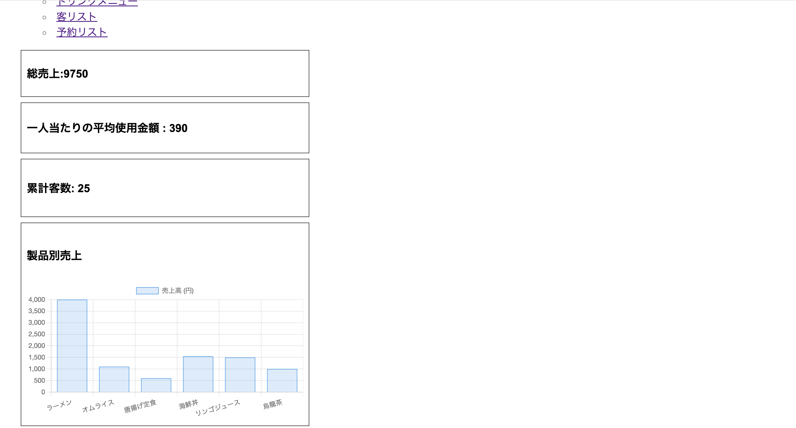

# k23059_11
第11回課題（作業報告書）

1.データ登録アプリケーションにて登録するデータと集計しトップページに載せる情報の詳細

飲食店の顧客やメニュー、入っている予約などのデータを登録する
・フードリスト
 -フードの商品名
 -その値段

・ドリンクリスト
 -ドリンクの商品名
 -その値段

・顧客リスト
 -顧客代表者の名前
 -予約人数

・予約リスト
 -顧客の名前
 -フード商品名
 -ドリンク商品名
 -予約の合計金額
 -全ての予約の合計金額

これらのデータから、総売上、一人当たりの平均使用金額、累計客数、製品別売上をそれぞれ算出する
・総売上
　予約リストの全ての予約の合計金額を表示

・一人当たりの平均使用金額
　総売上を累計客数でで割った値を表示

・累計客数
　客リストの予約人数を合計して表示

・製品別売上
　製品別にどれだけ売れたかを集計して、棒グラフにして表示

2.自分が担当した部分の説明

・それぞれ集計したデータをトップページに載せるためindex.htmlの変更を行なった。
見やすいように.flomeとして<box>を使用し囲むように工夫した。h2~h5ではfont-sizeを使用し文字サイズを合わせた。一度目のプルリクエストをえて、変数名をそれぞれが設定してくれた名前に変更した。
https://github.com/2024AIT-OOP2-G03/Restaurant_Information/pull/23
https://github.com/2024AIT-OOP2-G03/Restaurant_Information/pull/20

3.レビューを行なったグループメンバーのPullRequestのURL

・複数の人からデータをもらう担当だったため変数名を確認して自分が変数を合わせるようコメントで伝えた。
https://github.com/2024AIT-OOP2-G03/Restaurant_Information/pull/21
https://github.com/2024AIT-OOP2-G03/Restaurant_Information/pull/19

4.
  
 
5.感想

・他のアプリを使用しグループ内での報告が増え前回よりもスムーズに作業が進んでいるように思った。
よりスムーズに進めるために変数名など複数人からデータをもらう方はあらかじめグループ内で決めておくのが良いと思った。
次回からアプリケーションの作成がはじまるため、リーダーに積極的にわからないことは聞き足を引っ張らないようにしたい。
